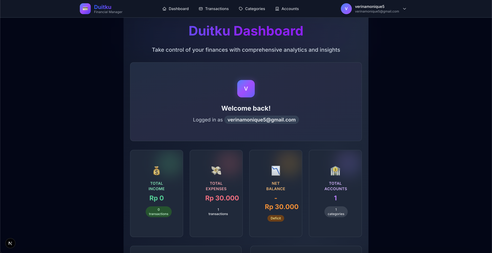
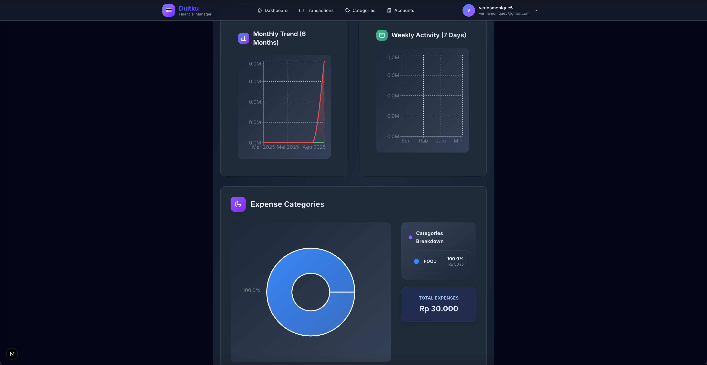
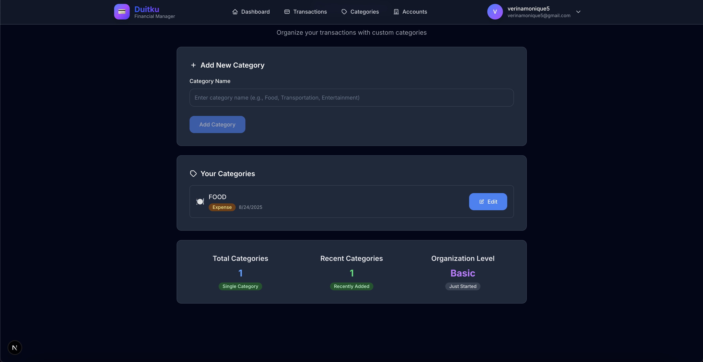
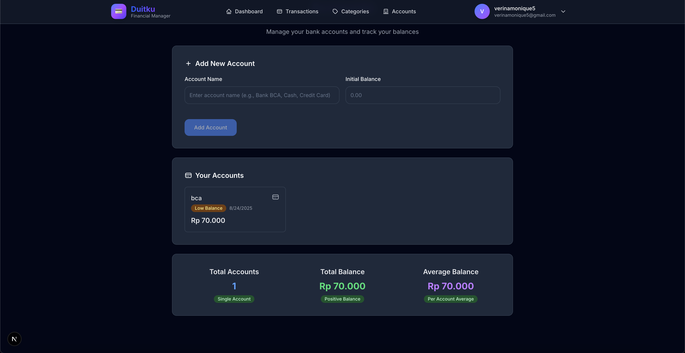
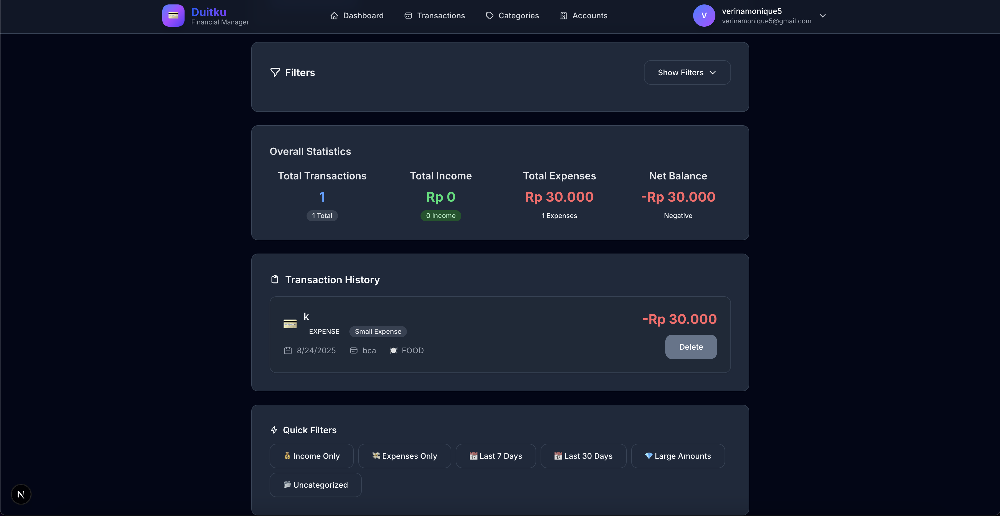

# 💰 Duitku Dashboard

**Duitku** is a **personal financial manager web application** that helps you take control of your money with powerful analytics, smart categorization, and easy-to-use dashboards.  
With Duitku, you can monitor income, expenses, accounts, and spending trends—all in one place.

---

## 🚀 Features

- 📊 **Analytics Dashboard** – Get real-time insights into your finances.
- 🍽️ **Smart Categories** – Organize expenses by categories (e.g., Food, Transportation, Entertainment).
- 📅 **Trends & Activity Tracking** – Visualize monthly trends and weekly activities.
- 🏦 **Account Management** – Add multiple bank/cash accounts and track balances.
- 🗂️ **Custom Categories** – Create your own expense/income categories.
- 🔎 **Transaction History & Filters** – Browse transaction history with quick filters (last 7 days, last 30 days, income only, expenses only).

---

## 🖼️ Screenshots

### 📊 Dashboard


### 📈 Analytics


### 🗂️ Categories


### 🏦 Accounts


### 🧾 Transactions


---

## 🛠️ Tech Stack

- **Frontend**: Next.Js 
- **Backend**: Go (https://github.com/leo140803/fe-duitku.git)
- **Styling**: TailwindCSS  
- **Database**: Supabase

---

## 📦 Installation

Clone the repository and run it locally:

```bash
git clone https://github.com/leo140803/fe-duitku.git
cd duitku-dashboard
npm install
npm run dev
